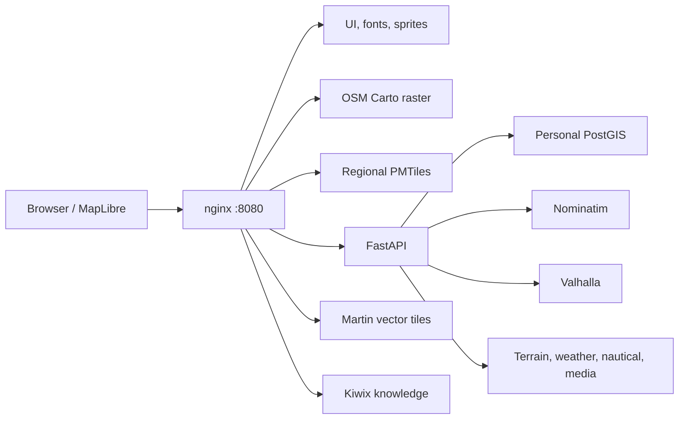

<p align="center">
  
</p>

# TerraSys Personal Offline Map

> English | [简体中文](README.zh-CN.md)
>
> Documentation snapshot: `2026-08-09` · Product identity: `TerraSys`

TerraSys is a local-first personal geographic information system for owning, exploring, and recovering offline map data. It combines an OpenStreetMap-style local renderer, portable regional vector maps, private places and tracks, address search, routing, terrain, weather, nautical references, a Chinese encyclopedia and travel guide, resource lifecycle management, backups, and disconnected recovery.

The project is designed for one trusted user on a local computer. Its only host-facing endpoint is:

```text
http://localhost:8080/
```

The resource and map-version console is available at:

```text
http://localhost:8080/resources.html
```

## Product principles

- **Data ownership:** source snapshots, regional packages, personal records, indexes, build tools, and recovery materials remain locally inspectable and portable.
- **Offline first:** installed maps, the world overview, personal data, search, routing, terrain, and local knowledge continue to work without the internet.
- **Truthful state:** downloads, builds, verification, updates, rollback, and failures are reported from real jobs and manifests rather than placeholders or guessed progress.
- **Replaceable layers:** rendering, storage, geocoding, routing, knowledge, and the browser UI have explicit boundaries.
- **Recoverability:** personal backups and complete offline kits use SHA256 manifests and can be tested on an isolated Docker network.

## Current capabilities

| Capability | Implementation |
| --- | --- |
| Familiar local map | OpenStreetMap Carto rendered locally with osm2pgsql, PostGIS, Mapnik, and mod_tile |
| Interactive regional map | Independently versioned PMTiles packages rendered by MapLibre GL JS |
| World overview | Local Natural Earth 110m/50m/10m vector PMTiles with land, water, boundaries, cities, major roads, rail, and rivers at zoom 0-7 |
| Personal data | PostGIS places, collections, tracks, notes, tags, ratings, and content-addressed media |
| Search | Lightweight local OSM reference index plus Nominatim address search and reverse geocoding |
| Routing | Valhalla driving, cycling, and walking routes with elevation profiles |
| Terrain | Local HGT elevation, Terrarium tiles, hillshade, and browser-generated contours |
| Context layers | Weather snapshots, nautical references, and emergency facilities |
| Local knowledge | Kiwix-hosted Chinese Wikipedia and Wikivoyage archives |
| Resource lifecycle | Global catalog, install/update/rebuild/verify/disable/rollback/remove jobs, and storage accounting |
| Recovery | Versioned database migrations, daily backups, portable exports, and disconnected recovery kits |

Jiangsu, Anhui, and Shandong are the current local map and shared-index scope. Regional derivative resources are derived from every installed and enabled package rather than a hard-coded province list. The catalog contains all 34 Chinese province-level units and more than 550 Geofabrik country or regional packages; only verified local products count as installed.

## Runtime architecture



The active Compose profile contains eight services: `web`, `api`, `postgis`, `martin`, `nominatim`, `valhalla`, `kiwix`, and `osm-carto`. Only nginx binds to `127.0.0.1`; internal databases and engines are not published to the LAN.

## Start and verify

```powershell
D:\TerraSys\start-terrasys.cmd
D:\TerraSys\health-check.cmd
D:\TerraSys\smoke-test.cmd
```

Ongoing development uses the layered [test suite](tests/README.md): `static` for every commit, `browser` for map and resource UI coverage, `full` for API and personal-data lifecycles, and `recovery` for the isolated disconnected recovery drill.

`start-terrasys.cmd` creates local secrets when required, starts Docker Desktop, applies ordered PostGIS migrations, builds the API image, starts the core stack, enables prepared advanced services, and starts the allowlisted maintenance worker.

Prepare or rebuild advanced offline capabilities:

```powershell
D:\TerraSys\prepare-advanced.cmd
```

Build or resume the OSM Carto renderer independently:

```powershell
powershell -NoProfile -ExecutionPolicy Bypass -File D:\TerraSys\scripts\build-osm-carto.ps1
```

Heavy builds are intentionally serialized on a 16 GiB host. Existing validated products remain active until their staged replacements pass verification.

## Routine operations

```powershell
D:\TerraSys\backup-terrasys.cmd
D:\TerraSys\region-pack.cmd List
D:\TerraSys\region-pack.cmd Verify
D:\TerraSys\rebuild-shared-indexes.cmd -Plan
D:\TerraSys\create-offline-kit.cmd
D:\TerraSys\test-offline-recovery.cmd
D:\TerraSys\stop-terrasys.cmd
```

The resource console exposes Available, Local, and Updates views. Regular update-all jobs exclude heavy map, knowledge, and shared-index builds. Each active task owns its queue position, stage, measured transfer or generation rate, cancellation action, and retry state.

## Storage and ownership

| Path | Role |
| --- | --- |
| `web/` | Browser application, local assets, and resource console |
| `services/` | Compose topology, API, nginx, Martin, tools, and PostGIS migrations |
| `config/` | OSM Carto and Planetiler build configuration |
| `raw/osm/` | Downloaded OSM snapshots, boundaries, state, and provenance |
| `products/tiles/pmtiles/` | Verified regional vector-map products and manifests |
| `products/routing/` | Valhalla graph versions |
| `products/elevation/` | Retained global HGT elevation grids synchronized for installed regions |
| `products/encyclopedia/` | Verified Kiwix ZIM archives |
| `data/` | Personal media, exports, terrain cache, and maintenance state |
| `backups/` | Personal PostGIS and media recovery points |
| `offline-kit/` | Complete disconnected recovery packages |
| `runtime/` and `tmp/` | Audits, logs, candidate builds, and renewable scratch data |

The canonical project path is `D:\TerraSys`; `C:\Users\Administrator\Documents\TerraSys` is a junction to the same files. Docker Desktop data is stored at `D:\DockerData\wsl`. Product text, scripts, containers, images, environment variables, browser keys, recovery payloads, and new database names use the TerraSys identity. Upgrade code migrates prior browser settings and can attach the existing verified Docker index volumes without copying them.

## Documentation

The [documentation index](docs/README.md) provides every guide in English and Simplified Chinese.

| Subject | English | 简体中文 |
| --- | --- | --- |
| Architecture | [English](docs/ARCHITECTURE.md) | [中文](docs/ARCHITECTURE.zh-CN.md) |
| Configuration | [English](docs/CONFIGURATION.md) | [中文](docs/CONFIGURATION.zh-CN.md) |
| Data pipeline | [English](docs/DATA_PIPELINE.md) | [中文](docs/DATA_PIPELINE.zh-CN.md) |
| Operations | [English](docs/OPERATIONS.md) | [中文](docs/OPERATIONS.zh-CN.md) |
| Rebuild | [English](docs/REBUILD.md) | [中文](docs/REBUILD.zh-CN.md) |
| Offline recovery | [English](docs/OFFLINE_RECOVERY.md) | [中文](docs/OFFLINE_RECOVERY.zh-CN.md) |
| Resource lifecycle | [English](docs/RESOURCE_AND_VERSION_MANAGEMENT.md) | [中文](docs/RESOURCE_AND_VERSION_MANAGEMENT.zh-CN.md) |
| Sources and licenses | [English](docs/SOURCES_AND_LICENSES.md) | [中文](docs/SOURCES_AND_LICENSES.zh-CN.md) |
| Roadmap | [English](docs/ROADMAP.md) | [中文](docs/ROADMAP.zh-CN.md) |
| Version history | [English](CHANGELOG.md) | [中文](CHANGELOG.zh-CN.md) |

## Versioning

The repository had no Git tags or GitHub Releases before this documentation snapshot. [CHANGELOG.md](CHANGELOG.md) reconstructs seven development milestones from non-merge commits and records the authoritative commit hash and ISO 8601 timestamp for each one. These milestone labels are documentation aids, not retroactively created releases.

## Security scope

TerraSys is a trusted, single-user localhost application. Do not bind it to `0.0.0.0` or expose it to the internet without authentication, TLS, rate limits, and a stricter upload policy.

## Project status

The project is actively evolving. Derived map and search products can be rebuilt; personal PostGIS records and content-addressed media are the durable source of truth.
