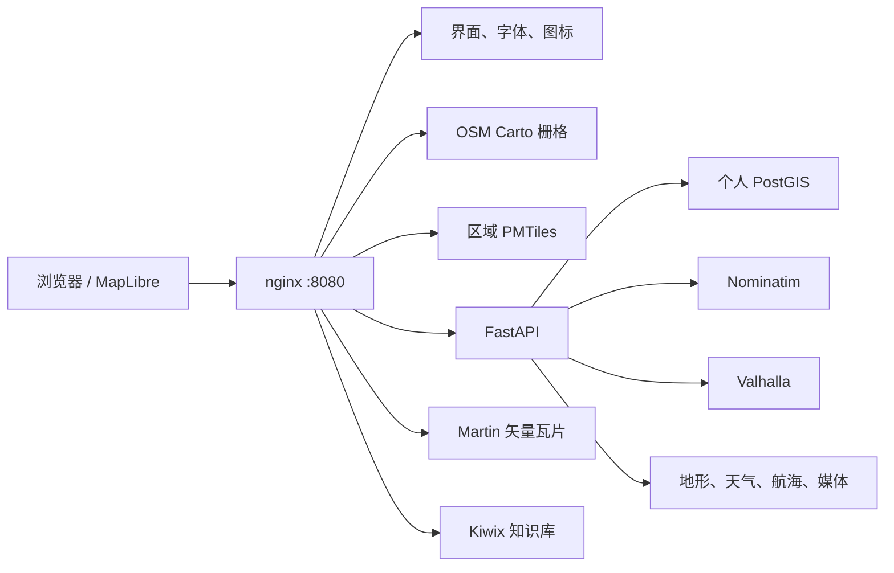

<p align="center">
  
</p>

# TerraSys 个人离线地图

> [English](README.md) | 简体中文
>
> 文档快照：`2026-08-09` · 产品标识：`TerraSys`

TerraSys 是一套本地优先的个人地理信息系统，用于拥有、浏览和恢复离线地图数据。系统组合了 OpenStreetMap 风格本地渲染、可移植区域矢量地图、个人点位与轨迹、地址搜索、路线规划、地形、天气、航海参考、中文百科与旅行指南、资源生命周期管理、备份和断网恢复。

项目面向一台受信任计算机上的单用户，唯一对宿主机开放的入口是：

```text
http://localhost:8080/
```

资源和地图版本管理页面：

```text
http://localhost:8080/resources.html
```

## 产品原则

- **数据自主**：源快照、区域包、个人资料、索引、构建工具和恢复材料都能在本地检查、迁移和重建。
- **离线优先**：断网后继续使用已安装地图、全球概览、个人数据、搜索、路线、地形和本地知识库。
- **真实状态**：下载、构建、校验、更新、回退和失败信息来自真实任务和清单，不显示占位功能或猜测进度。
- **分层可替换**：渲染、存储、地理编码、路线、知识库与浏览器界面都有明确边界。
- **可恢复**：个人备份与完整离线包使用 SHA256 清单，并可在隔离的 Docker 网络中演练。

## 当前能力

| 能力 | 实现 |
| --- | --- |
| 熟悉的本地地图 | 使用 osm2pgsql、PostGIS、Mapnik 和 mod_tile 本地渲染 OpenStreetMap Carto |
| 可交互区域地图 | MapLibre GL JS 渲染独立版本管理的 PMTiles 区域包 |
| 全球概览 | 本地 Natural Earth 110m/50m/10m 多级矢量 PMTiles，z0-7 包含陆地、水体、国省界、城市、主要道路、铁路和河流 |
| 个人数据 | PostGIS 点位、集合、轨迹、备注、标签、评分和内容寻址媒体 |
| 搜索 | 轻量 OSM 参考索引，以及 Nominatim 地址搜索和反向地理编码 |
| 路线 | Valhalla 驾车、骑行、步行路线与海拔剖面 |
| 地形 | 本地 HGT、Terrarium 瓦片、阴影和浏览器生成的等高线 |
| 环境参考 | 天气快照、航海参考和应急设施 |
| 本地知识 | Kiwix 托管的中文维基百科与维基导游 |
| 资源生命周期 | 全球目录、安装、更新、重建、校验、停用、回退、删除和磁盘统计 |
| 恢复能力 | 版本化数据库迁移、每日备份、可移植导出和断网恢复包 |

江苏、安徽和山东是当前本地地图及共享索引范围。区域派生资源由全部已安装且启用的地图包自动推导，不再写死省份列表。资源目录包含中国 34 个省级单元和 550 多个 Geofabrik 国家或地区包；只有通过校验的本地产品才算已安装。

## 运行架构



当前 Compose 高级配置包含八个服务：`web`、`api`、`postgis`、`martin`、`nominatim`、`valhalla`、`kiwix` 和 `osm-carto`。只有 nginx 绑定 `127.0.0.1`，内部数据库与引擎不向局域网开放。

## 启动与验证

```powershell
D:\TerraSys\start-terrasys.cmd
D:\TerraSys\health-check.cmd
D:\TerraSys\smoke-test.cmd
```

后续开发使用分层的[测试用例集](tests/README.zh-CN.md)：`static` 适合每次提交，`browser` 覆盖地图与资源界面，`full` 增加 API 和个人数据生命周期，`recovery` 增加隔离断网恢复演练。

`start-terrasys.cmd` 会在需要时创建本地密钥、启动 Docker Desktop、应用有序 PostGIS 迁移、构建 API 镜像、启动核心服务和已准备的高级服务，并启动白名单维护任务工作器。

准备或重建高级离线能力：

```powershell
D:\TerraSys\prepare-advanced.cmd
```

独立构建或续建 OSM Carto 渲染器：

```powershell
powershell -NoProfile -ExecutionPolicy Bypass -File D:\TerraSys\scripts\build-osm-carto.ps1
```

在 16 GiB 主机上，重型构建会串行执行。新产品只有在暂存版本通过校验后才替换当前可用版本。

## 日常操作

```powershell
D:\TerraSys\backup-terrasys.cmd
D:\TerraSys\region-pack.cmd List
D:\TerraSys\region-pack.cmd Verify
D:\TerraSys\rebuild-shared-indexes.cmd -Plan
D:\TerraSys\create-offline-kit.cmd
D:\TerraSys\test-offline-recovery.cmd
D:\TerraSys\stop-terrasys.cmd
```

资源页面提供“可获取、本地、可更新”三个视图。常规批量更新不会自动包含地图构建、知识库下载和共享索引重建等重型任务。每个活动任务在自身行内显示队列位置、阶段、实测速率、取消操作和重试状态。

## 存储与所有权

| 路径 | 作用 |
| --- | --- |
| `web/` | 浏览器应用、本地资源和资源管理页面 |
| `services/` | Compose、API、nginx、Martin、工具和 PostGIS 迁移 |
| `config/` | OSM Carto 与 Planetiler 构建配置 |
| `raw/osm/` | OSM 快照、边界、状态和来源记录 |
| `products/tiles/pmtiles/` | 已校验区域矢量地图及清单 |
| `products/routing/` | Valhalla 路线图版本 |
| `products/elevation/` | 按已安装区域长期保留的全球 HGT 高程格网 |
| `products/encyclopedia/` | 已校验 Kiwix ZIM 文件 |
| `data/` | 个人媒体、导出、地形缓存和维护状态 |
| `backups/` | 个人 PostGIS 与媒体恢复点 |
| `offline-kit/` | 完整断网恢复包 |
| `runtime/`、`tmp/` | 审计、日志、候选构建和可再生临时数据 |

项目统一入口为 `D:\TerraSys`；`C:\Users\Administrator\Documents\TerraSys` 是指向同一份文件的 Junction。Docker Desktop 数据位于 `D:\DockerData\wsl`。产品文案、脚本、容器、镜像、环境变量、浏览器键、恢复包目录和新数据库名称均使用 TerraSys 标识；升级代码会迁移旧浏览器设置，并直接挂载已经校验的 Docker 索引卷，无需复制大体积数据。

## 文档

[文档索引](docs/README.zh-CN.md)列出了每份英文和简体中文指南。

| 主题 | English | 简体中文 |
| --- | --- | --- |
| 架构 | [English](docs/ARCHITECTURE.md) | [中文](docs/ARCHITECTURE.zh-CN.md) |
| 配置 | [English](docs/CONFIGURATION.md) | [中文](docs/CONFIGURATION.zh-CN.md) |
| 数据流水线 | [English](docs/DATA_PIPELINE.md) | [中文](docs/DATA_PIPELINE.zh-CN.md) |
| 运维 | [English](docs/OPERATIONS.md) | [中文](docs/OPERATIONS.zh-CN.md) |
| 从零重建 | [English](docs/REBUILD.md) | [中文](docs/REBUILD.zh-CN.md) |
| 离线恢复 | [English](docs/OFFLINE_RECOVERY.md) | [中文](docs/OFFLINE_RECOVERY.zh-CN.md) |
| 资源生命周期 | [English](docs/RESOURCE_AND_VERSION_MANAGEMENT.md) | [中文](docs/RESOURCE_AND_VERSION_MANAGEMENT.zh-CN.md) |
| 来源与许可 | [English](docs/SOURCES_AND_LICENSES.md) | [中文](docs/SOURCES_AND_LICENSES.zh-CN.md) |
| 路线图 | [English](docs/ROADMAP.md) | [中文](docs/ROADMAP.zh-CN.md) |
| 版本历史 | [English](CHANGELOG.md) | [中文](CHANGELOG.zh-CN.md) |

## 版本规则

本次文档快照之前，仓库没有 Git tag 或 GitHub Release。[CHANGELOG.zh-CN.md](CHANGELOG.zh-CN.md)根据非合并提交追溯整理了七个开发里程碑，并为每项保留权威提交哈希和 ISO 8601 时间戳。这些里程碑编号用于阅读历史，不代表补建了历史 Release。

## 安全边界

TerraSys 是受信任环境中的单用户 localhost 应用。没有加入身份认证、TLS、限流和更严格的上传策略前，不应绑定 `0.0.0.0` 或直接暴露到互联网。

## 项目状态

项目仍在持续演进。地图和搜索产品属于可重建派生数据；个人 PostGIS 记录与内容寻址媒体才是持久的权威数据。
